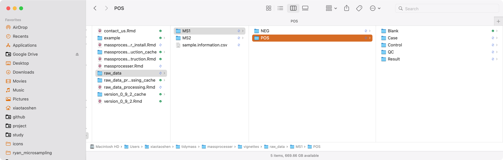

```{r, include = FALSE, echo=FALSE}
knitr::opts_chunk$set(
  collapse = TRUE,
  comment = "#>",
  # fig.width = 7, 
  # fig.height = 5,
  warning = FALSE,
  message = TRUE,
  out.width = "100%"
)
```

***

# **Download demo data**

Raw data can be downloaded from the Google drive. [Link is here](https://drive.google.com/drive/folders/1aAr9kfjXPDskgEImhHNlAIdW9c3m-HAi?usp=sharing)

# **Data preparation**

*massprocesser* can used to processed the raw MS data for peak detection and alignment, and generate a peak table for next analysis. 

The MS raw data from Mass Spectrometry should be converted to `mzXML` or `mzML`format and then placed in different folders according to their class, for example `Subject`, `QC`, and `Blank` samples.



You can convert raw MS data to `mzXML` or `mzML` format using [`ProteoWizard` software](http://proteowizard.sourceforge.net/). And the parameter setting is shown the below figure:


> The demo data have been converted to `mzML` format.

# **Data organization**

All the `mzXML` format files should be placed in different folder according to sample type, such as `QC`, `Subject`, and `Blank`. 


# **Run `process_data()`** function

This function is used to peak picking and peak alignment.

```{r,eval=FALSE,warning=FALSE, R.options="", message=FALSE}
library(massprocesser)
library(tidyverse)
library(xcms)
library(MSnbase)
library(mzR)
```

## **Data processing**

Next, we use the `process_data()` function for peak detection and alignment.

We first do the positive mode.

```{r,eval=FALSE,warning=FALSE, message=FALSE,R.options="",cache=TRUE, message=FALSE}
massprocesser::process_data(
  path = "raw_data/MS1/POS/",
  polarity = "positive",
  ppm = 15,
  peakwidth = c(5, 30),
  snthresh = 5,
  noise = 500,
  threads = 6,
  output_tic = TRUE,
  output_bpc = TRUE,
  output_rt_correction_plot = TRUE,
  min_fraction = 0.5,
  fill_peaks = FALSE,
  group_for_figure = "QC"
)
```

Some important arguments:

* `ppm`: Peak detection ppm. See the `xcms` package.

* `peakwidth`: Peak width. It is dependent on your column and LC system. See the `xcms` package.

* `snthresh`: Singal to noise threshold. See the `xcms` package.

* `noise`: Noise cutiff. See the `xcms` package.

* `threads`: The core number for performing.

* `output_tic`, `output_bpc`, and `group_for_figure`: Do you want to output the TIC or BPC of samples? Some times there are a lot of samples, so you can set the `group.for.figure` as the group name, for example, you can set it as `QC`. 

* `min_fraction`: If one peak appears more than `min.fraction` sample in at least one group samples it will be kept.

* `fill_peaks`: Do you want to fill the missing values (NA)? 

Other parameters you can find here: `process_data()`.

# **Output results**

After all done, all the results are placed in a new folder named as `Result`.


* `Peak_table.csv`: is the peak table for next analysis.


* `Peak_table_for_cleaning.csv`: Some non-useful columns is deleted from the `Peak_table.csv`, this can be directory used for next data cleaning.


* `intermediate_data`: This is a folder which contains some intermediate data. If you want to re-run the data processing, please delete this folder first.

# **Session information**

```{r,eval=FALSE,warning=FALSE, R.options="", message=FALSE, cache=TRUE}
sessionInfo()
```
